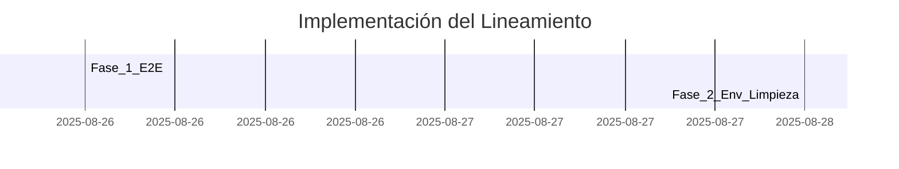

# Nivel 1 - Planificación de Desarrollo Asistido por IA

## Resumen Ejecutivo
Este lineamiento define cómo construir un **MVP funcional con el mínimo código posible**, cuidando la **limpieza básica**, evitando la **sobreingeniería**, dejando **variables sensibles** claramente **marcadas** para futura extracción a `.env`, y acompañando con **comentarios breves** que faciliten el entendimiento y la posterior mejora.

## Contexto y Justificación
Se usa cuando necesitamos validar rápido una idea, una integración o un flujo end‑to‑end sin invertir en arquitecturas complejas. Permite acelerar aprendizaje y reducir coste inicial, con la condición de que habrá una **revisión posterior** para evolucionar a niveles superiores.

## Alcance de Aplicación

### Módulos/Componentes Afectados
- **Prototipos Frontend**: pantallas y flows mínimos para validar UX.
- **Servicios Backend mínimos**: endpoints y wiring básico para flujo E2E.
- **Scripts de integración**: conectores simples a APIs/DB necesarias.

### Tecnologías/Frameworks Aplicables
- Node.js / Express
- React / React Native (pantallas mínimas)
- MySQL / SQLite (según facilidad)
- Axios / Fetch para llamadas HTTP

## Lineamientos Técnicos

### Principios Fundamentales
0. **MVP funcional con el mínimo código posible**: construir sólo lo necesario para que el flujo funcione de punta a punta.
   - **Justificación**: reducir tiempo a aprendizaje/feedback.
   - **Impacto**: entrega temprana y menor complejidad inicial.

1. **Modularización y estructuración mínima**: organizar lo justo para no caer en caos.
   - **Justificación**: equilibrio entre ordenar y no sobre‑estructurar.
   - **Impacto**: menor deuda de refactor en la evolución a nivel 2+.

2. **Evitar el caos sin caer en la sobreingeniería**: nada de duplicaciones groseras ni capas innecesarias.
   - **Justificación**: el costo de arreglar caos supera el “ahorro” inicial.
   - **Impacto**: base limpia que permite iterar.

3. **Variables sensibles o configurables**: se dejan in‑code con **nombres descriptivos** y **comentadas** para futura extracción a `.env`.
   - **Justificación**: velocidad hoy, externalización mañana.
   - **Impacto**: transición simple a configuraciones seguras.

4. **Documentación en comentarios**: breve, clara, enfocada en qué hace y qué es temporal.
   - **Justificación**: baja fricción para entender y mejorar.
   - **Impacto**: reduce dependencia del autor original.

### Reglas de Implementación
#### Código mínimo y funcional
**Obligatorio**: Sí  
**Descripción**: el MVP debe cubrir 1 flujo E2E completo con la menor cantidad de archivos y dependencias.

#### Orden básico sin over‑design
**Obligatorio**: Sí  
**Descripción**: crear funciones/módulos sólo cuando eviten duplicación evidente o mejoren legibilidad neta.

#### Sin abstracciones tempranas
**Obligatorio**: Sí  
**Descripción**: prohibido crear factories/generics/APIs genéricas si no hay 2+ casos reales hoy.

#### Variables sensibles comentadas
**Obligatorio**: Sí  
**Descripción**: definir constantes (p.ej. API_URL, API_KEY_PLACEHOLDER) y comentar “mover a .env en Nivel 2”.

#### Comentarios útiles y breves
**Obligatorio**: Sí  
**Descripción**: comentar bloques clave, señalar configuraciones temporales y TODOs para evolución.

## Validación y Cumplimiento

### Criterios de Validación
- **Flujo E2E**: un caso de uso corre de punta a punta sin errores.
  - Herramientas: ejecución manual, Postman/Thunder Client.
  - Umbral: 1 flujo validado.
- **Simplicidad**: no existen capas innecesarias (services vacíos, repos genéricos sin uso, etc.).
  - Herramientas: code review de 10′.
  - Umbral: 0 abstracciones sin uso actual.
- **Duplicación**: no hay duplicaciones groseras.
  - Herramientas: revisión visual, `npm run lint` si aplica.
  - Umbral: 0 duplicaciones evidentes.
- **Variables comentadas**: las sensibles/configurables están nombradas y comentadas.
  - Herramientas: revisión de código.
  - Umbral: 100% de las variables sensibles señaladas.
- **Comentarios claros**: bloques clave explicados en ≤2 líneas.
  - Herramientas: revisión de código.
  - Umbral: cumple en los puntos críticos.

### Automatización
```bash
# Comandos de validación automática
npm run build               # compila el frontend/backend si aplica
npm test -- --passWithNoTests # tests opcionales en nivel 1
npm run lint                # chequeos básicos de estilo
```

## Impacto en el Sistema

### Beneficios Esperados
- **Velocidad**: entrega temprana y feedback rápido.
  - Métricas: lead time a primer demo (días).
- **Calidad mínima sostenible**: orden básico y sin caos.
  - Métricas: issues por “desorden” en primeras 2 semanas.
- **Evolución simple**: base lista para extraer a `.env` y modularizar.
  - Métricas: esfuerzo estimado para pasar a nivel 2.

### Riesgos y Mitigación
- **Riesgo**: acumular deuda si el “nivel 1” se eterniza.  
  - **Probabilidad**: Media — **Impacto**: Alto — **Mitigación**: fecha de caducidad y revisión obligatoria.
- **Riesgo**: variables sensibles en código por más tiempo del debido.  
  - **Probabilidad**: Baja — **Impacto**: Alto — **Mitigación**: tickets de extracción a `.env` en siguiente sprint.

## Implementación Gradual

### Pilotos y Fases
- **Fase 1**: flujo E2E mínimo (demo interna).
  - **Componentes**: 1 pantalla + 1 endpoint + 1 tabla/consulta.
  - **Criterios de éxito**: demo usable por un usuario real.
- **Fase 2**: limpieza ligera + extracción a `.env`.
  - **Componentes**: mover constantes, ajustar README.
  - **Criterios de éxito**: despliegue simple a entorno de pruebas.

### Roadmap de Migración


## Referencias y Documentación
- Fuente primaria: level1.md (síntesis y adaptación al formato de lineamientos).
- Guías internas de estilo (si aplican).
- TODOs del equipo para evolución a Nivel 2+.

## Versionado y Evolución

### Historial de Cambios
#### v1.0.0 (2025-08-26)
- añadido: documento inicial siguiendo el formato `lineamiento.hbs`.
- mapeado: principios y reglas desde level1.md a secciones formales.
- agregado: criterios de validación y comandos de chequeo.

### Proceso de Actualización
Proponer cambios vía PR, validar con responsable del lineamiento, actualizar versión semántica y fechas.

---

**Lineamiento aplicable desde**: 2025-08-26  
**Revisión obligatoria cada**: 90 días  
**Responsable**: Gerencia de Integración Tecnológica  
**Última validación**: 2025-08-26

## Metadatos para MCP
```json
{
  "mcp_searchable": true,
  "keywords": ["MVP", "lineamiento", "nivel1", "sobreingenieria", "comentarios", "env", "prototipo"],
  "embedding_weight": 0.6,
  "priority_score": 0.8,
  "enforcement_level": "soft"
}
```
