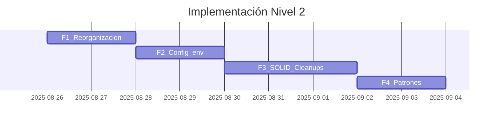

# Nivel 2 - Estructuración y Principios de Diseño

## Resumen Ejecutivo
Este lineamiento consolida lo logrado en **Nivel 1** y eleva la **estructura**, **mantenibilidad** y **claridad** del código mediante organización por responsabilidades, principios **SOLID**, **Clean Code** y **patrones de diseño** aplicados con criterio. Se **mantienen contratos públicos** existentes y se **centraliza la configuración** en `config/` con variables de entorno.

## Contexto y Justificación
El crecimiento del MVP exige orden y separaciones explícitas de responsabilidades para: 
- facilitar cambios sin romper contratos,
- habilitar extensiones con bajo acoplamiento,
- reducir deuda técnica temprana,
- y sostener la velocidad de entrega.

## Alcance de Aplicación

### Estándares de Organización
- Carpetas claras en backend: `controllers/`, `services/`, `models/`, `utils/`, `config/`.
- Frontend (React): `components/`, `pages/`, `services/`, `hooks/`, `context/`, `config/`.
- Nombrado coherente con el dominio, evitando jerarquías innecesariamente profundas.
- Compatibilidad total con la funcionalidad de **Nivel 1**.

### Contratos que NO deben romperse
- Interfaz pública hacia BD y servicios externos (mismo contrato).
- Reglas de negocio y casos de uso válidos en Nivel 1 deben conservarse.
- API y endpoints: sin cambios de firma ni formatos de respuesta.

## Lineamientos Técnicos

### Principios SOLID
- **S** (Responsabilidad Única): cada módulo hace una cosa bien.
- **O** (Abierto/Cerrado): extender sin modificar lo estable.
- **L** (Sustitución de Liskov): sustituibles sin romper lógica.
- **I** (Segregación de Interfaces): evitar “interfaces gordas”.
- **D** (Inversión de Dependencias): depender de abstracciones.

### Patrones de Diseño (aplicar cuando aporten claridad)
- **Factory**: instanciación flexible de servicios/adaptadores.
- **Strategy**: variantes de lógicas (p. ej. cálculo, validación).
- **Adapter**: normalizar servicios/SDK de terceros.
- **Singleton**: recursos únicos (p. ej. pool/conexión BD).
> Evitar patrones sin una necesidad real; priorizar simplicidad.

### Principios de Clean Code
- Nombres descriptivos y consistentes con el dominio.
- Funciones/métodos cortos y con responsabilidad única.
- Eliminar código muerto, duplicado o comentarios innecesarios.
- Legibilidad > “magia” o micro‑optimizaciones prematuras.

### Configuración y Variables de Entorno
- **Centralizar** en `config/` cargado desde `.env`.
- Backend: `dotenv` y acceso controlado (evitar `process.env` disperso).
- Frontend: usar prefijos `VITE_` o `REACT_APP_` (según bundler).
- Validar variables requeridas al inicio (fail‑fast).

### Documentación mínima pero útil
- Registrar **decisiones no obvias** y su motivación (ADR liviano).
- Comentar sólo cuando agrega contexto; evitar redundancias.
- Indicar patrones aplicados y diagramas simples cuando ayudan.

### Notas específicas por stack
**Node.js**
- Modularidad por dominio; contratos (interfaces implícitas/TS).
- Eslint + Prettier; opcional TypeScript para tipos y DX.
- Framework sugerido según contexto: Express/Fastify/NestJS.
- Test mínimo en caminos críticos (unitarios/integración livianos).

**React**
- Componentes puros y reutilizables; hooks para lógica compartida.
- Tipado (TS) o PropTypes.
- Context para dependencias transversales (p. ej. sesión, config).
- `services/` para capa HTTP; evitar llamadas directas en componentes.
- Centralizar configuración en `config.ts/js`.

## Reglas de Implementación (Checklist)

- [ ] Estructura de carpetas conforme a estándares.
- [ ] Contratos públicos inmutables respecto a Nivel 1.
- [ ] Config centralizada y validada al iniciar la app.
- [ ] Patrones aplicados sólo cuando agregan claridad.
- [ ] Eliminado código duplicado/muerto y comentarios superfluos.
- [ ] Lint formatea sin advertencias; build limpio.
- [ ] Tests mínimos para caminos críticos.

## Validación y Cumplimiento

### Criterios de Aceptación
- **Compatibilidad**: endpoints y contratos preexistentes funcionan sin cambios.
- **Mantenibilidad**: módulos con SRP y dependencias claras.
- **Configuración**: lectura única de `.env` vía `config/`.
- **Calidad**: sin duplicaciones groseras; funciones cortas.
- **Patrones**: documentados cuando se adopten.

### Automatización
```bash
# Calidad
npm run lint
npm run format:check || echo "Sugerir 'npm run format'"
# Build
npm run build
# Tests mínimos (cobertura crítica, no total)
npm test -- --passWithNoTests
```

## Impacto en el Sistema

### Beneficios Esperados
- Mayor legibilidad y menores costos de cambio.
- Extensibilidad sin romper contratos (OCP/DI).
- Incubadora lista para Nivel 3 (pruebas, calidad, documentación).

### Riesgos y Mitigación
- **Sobre‑patronización**: aplicar por moda. → Revisiones de diseño cortas.
- **Ruptura accidental de contratos**: → Tests de regresión en endpoints clave.
- **Config dispersa**: → Auditoría de acceso a variables y centralización.

## Implementación Gradual

### Fases
- **F1 – Reorganización**: mover a estructura estándar (sin cambiar lógica).
- **F2 – Config centralizada**: `.env` + validación inicial + `config/`.
- **F3 – SOLID & Cleanups**: separar responsabilidades, remover duplicaciones.
- **F4 – Patrones con propósito**: introducir Strategy/Factory/Adapter si aplica.

### Roadmap (Mermaid)


## Referencias y Documentación
- Base conceptual adaptada de **Lineamientos2.md**.
- Estándares internos de estilo y ADRs.
- Guías de React/Node del equipo.

## Versionado y Evolución

### Historial de Cambios
#### v1.0.0 (2025-08-26)
- Documento inicial en formato `lineamiento.hbs`.
- Incorporación de SOLID, Clean Code y Patrones aplicables.
- Centralización de configuración y checklist de implementación.

### Proceso de Actualización
Proponer cambios vía PR, validar con responsables técnicos, versionado semántico y actualización de fechas.

---

**Lineamiento aplicable desde**: 2025-08-26  
**Revisión obligatoria cada**: 90 días  
**Responsable**: Gerencia de Integración Tecnológica  
**Última validación**: 2025-08-26

## Metadatos para MCP
```json
{
  "mcp_searchable": true,
  "keywords": ["nivel2", "arquitectura", "SOLID", "clean code", "patrones", "config", "node", "react"],
  "embedding_weight": 0.7,
  "priority_score": 0.85,
  "enforcement_level": "medium"
}
```
