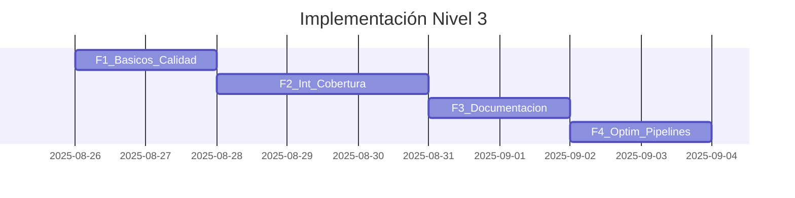

# Nivel 3 — Pruebas, Calidad y Documentación Exhaustiva

## Resumen Ejecutivo
Este lineamiento eleva la **confiabilidad** del software con **pruebas sistemáticas**, **calidad automatizada** y **documentación completa**. Se consolida lo logrado en **Nivel 1 y Nivel 2** garantizando que el código sea **probado, verificable y entendible** por cualquier miembro del equipo.

## Contexto y Justificación
Con el crecimiento funcional, la ausencia de pruebas y documentación se convierte en freno. Nivel 3 establece un **mínimo profesional**: pruebas para caminos críticos, cobertura significativa, pipelines con validaciones automáticas, y documentación que refleje el comportamiento real.

## Alcance de Aplicación

### Estándares
- Escribir **pruebas unitarias** para funciones, clases y componentes clave.
- Incluir **pruebas de integración** para validar interacciones entre módulos y servicios.
- Mantener **cobertura significativa** enfocada en caminos críticos (evitar perseguir 100% sin valor).
- **Automatizar** pruebas y chequeos (pre-commit y CI/CD).
- **Linter + formateo** según el stack y sin advertencias en main.
- **Documentación exhaustiva**: módulos, clases y funciones con parámetros, retornos, excepciones y ejemplos.

### Contratos que NO deben romperse
- Comportamientos validados en Niveles 1 y 2 continúan funcionando.
- Endpoints públicos y contratos de datos se mantienen, o se migran con pruebas equivalentes y notas de versión.
- La documentación refleja el código real (sin desincronización).

## Lineamientos Técnicos

### Pruebas unitarias
- Casos normales, bordes y fallos esperados.
- **Frameworks**: Jest/Vitest (Node/React), Pytest (Python), JUnit (Java), etc.
- Asegurar que cada función cumple su contrato: **Given/When/Then** en casos clave.

### Pruebas de integración
- Flujos que atraviesan múltiples componentes.
- Mock/stub de dependencias externas cuando sea necesario.
- Validar integridad con APIs/DB/colas en entornos de prueba.

### Cobertura de pruebas
- **Objetivo**: mínimo eficiente para máxima confianza.
- **Umbral sugerido** (ajustable por equipo): 80–85% global y 100% en **caminos críticos**.
- Reportes de cobertura publicados por CI.

### Ejecución de pruebas y automatización
- Todas las pruebas deben pasar al finalizar el nivel.
- **Pre‑commit/pre‑push**: hooks para lint, format y tests rápidos.
- **CI/CD**: ejecutar build, lint, tests y cobertura en cada PR a main.

### Linting y calidad del código
- Node/React: `eslint` + `prettier`.
- Python: `ruff` (lint), `black` (formato), `isort` (imports).
- Eliminar código muerto, resolver smells y mantener convenciones.

### Documentación exhaustiva
- Docstrings o comentarios estructurados (Google/Numpy/reST en Python; TSDoc/JSDoc en TS/JS).
- Generadores: Sphinx/pdoc/mkdocstrings (Python); TypeDoc/Docusaurus/Storybook (JS/TS).
- Guías de uso y ejemplos en README por módulo.
- Política “**docs en el PR**”: cambios relevantes deben incluir actualización de docs.

## Reglas de Implementación (Checklist)
- [ ] Unit tests en funciones/clases/componentes clave.
- [ ] Integration tests en flujos E2E o multi‑módulo.
- [ ] Umbral de cobertura configurado en CI (≥ 80% global; 100% en críticos).
- [ ] Lint y formateo automáticos, sin warnings en rama principal.
- [ ] Pipelines con build + lint + tests + cobertura + publicación de reportes.
- [ ] Documentación generada y actualizada (APIs públicas y módulos).
- [ ] README por módulo con ejemplos cuando aplique.

## Validación y Cumplimiento

### Criterios de Aceptación
- **Compatibilidad**: contratos de Niveles 1 y 2 siguen vigentes.
- **Confiabilidad**: tests verdes y cobertura en umbral.
- **Calidad**: sin duplicaciones groseras ni smells evidentes.
- **Documentación**: navegable y sincronizada con el código.

### Automatización (comandos sugeridos)
**Node/React**
```bash
npm run lint
npm run format:check || echo "Sugerido: npm run format"
npm run test -- --coverage --passWithNoTests
npm run build
```

**Python**
```bash
ruff check .
black --check . && isort --check-only .
pytest --cov=src --cov-report=xml
```

**CI/CD (ejemplo de jobs mínimos)**
- `build`: compila proyecto(s) y valida TS si aplica.
- `quality`: lint + format check.
- `test`: unit + integration + coverage.
- `docs`: genera y publica documentación.

## Impacto en el Sistema

### Beneficios Esperados
- **Confiabilidad**: menos regresiones y fallas en producción.
- **Mantenibilidad**: cambios más seguros y previsibles.
- **Onboarding**: documentación y tests acortan curva de aprendizaje.

### Riesgos y Mitigación
- **Perseguir cobertura vacía** → Enfocar en caminos críticos; revisar métricas de valor.
- **Pipelines lentas** → Paralelizar jobs, cachear dependencias, suites por etiquetas.
- **Docs desactualizadas** → Política “docs en el PR” + chequeos automáticos.

## Implementación Gradual

### Fases
- **F1 – Básicos de calidad**: lint + format + tests en módulos críticos.
- **F2 – Integración & cobertura**: flujos E2E y umbrales en CI.
- **F3 – Documentación**: docstrings, generadores y README por módulo.
- **F4 – Optimización pipelines**: paralelismo, caching y reportes automáticos.

### Roadmap (Mermaid)


## Referencias y Documentación
- Base conceptual adaptada de **Lineamientos3.md**.
- Convenciones internas de pruebas, estilo y CI/CD.
- Guías de frameworks (Jest/Vitest, Pytest, ESLint/Prettier, Ruff/Black/Isort, Sphinx/TypeDoc).

## Versionado y Evolución

### Historial de Cambios
#### v1.0.0 (2025-08-26)
- Documento inicial en formato `lineamiento.hbs`.
- Incorporación de pruebas unitarias e integración + cobertura mínima.
- Lint/format automáticos y documentación generada.

### Proceso de Actualización
Proponer cambios vía PR, validación por responsables técnicos, versionado semántico y actualización de fechas.

---

**Lineamiento aplicable desde**: 2025-08-26  
**Revisión obligatoria cada**: 90 días  
**Responsable**: Gerencia de Integración Tecnológica  
**Última validación**: 2025-08-26

## Metadatos para MCP
```json
{
  "mcp_searchable": true,
  "keywords": ["nivel3", "pruebas", "integración", "cobertura", "lint", "documentación", "ci/cd"],
  "embedding_weight": 0.75,
  "priority_score": 0.9,
  "enforcement_level": "strict"
}
```
